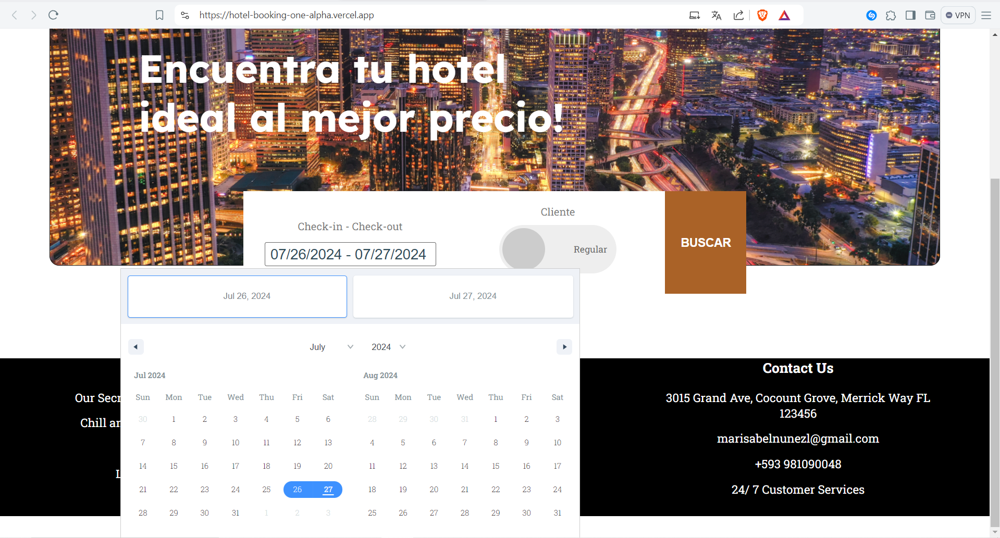
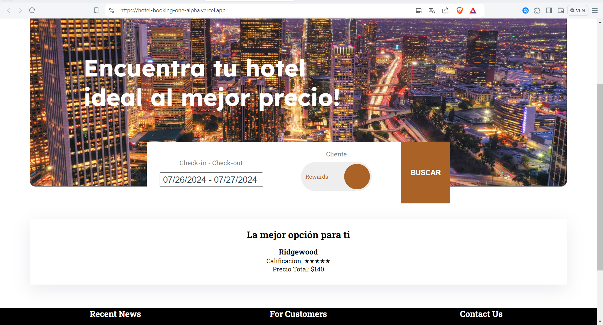
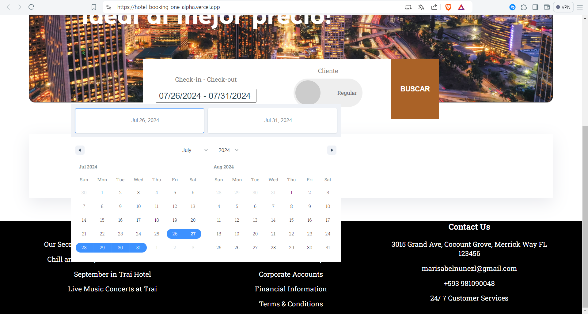
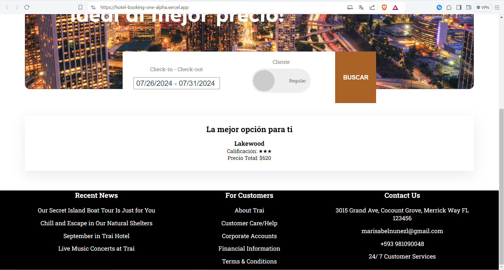

## Diseño 🛠
La aplicación permite ingresar diversas fechas y seleccionar entre cliente regular y cliente con recompensas mediante un toggle. 
Cada tarjeta de hotel contiene:
🏨 Nombre del hotel
⭐ Calificación en estrellas visuales
💵 Precio correspondiente a la fecha seleccionada.

### Capturas de pantalla:

## Tecnologías 🚀
React: Framework para construir la interfaz de usuario.
react-date-range: Biblioteca para la selección de fechas y rangos de fechas. 

## Link a demo 👀
¿Quieres ver cómo quedó esta réplica en acción? ¡Puedes visitar el siguiente enlace para ver el demo en vivo!
👉 [Hotel Booking]([https://hotel-booking-one-alpha.vercel.app/])
